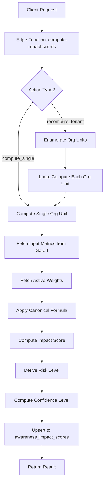

# Gate-J Part 3 — Formula Engine Execution Summary

**Gate-J — Awareness Impact Engine (v1)**  
**Phase: Formula Computation Engine (Server Logic)**  
**Status:** ✅ Completed  
**Date:** 2025-11-15

---

## 📋 Executive Summary

This document summarizes the implementation of **Gate-J Part 3 — Formula Computation Engine**, which provides backend/server logic for computing Awareness Impact Scores. This phase focused exclusively on backend computation without UI components.

---

## 🎯 Scope of Work

### ✅ Deliverables Completed

1. **Backend Service Module**
   - Created `src/integrations/supabase/impact.ts` (integration layer)
   - Created `src/services/impactService.ts` (client-side service)
   - Created `src/types/impact.ts` (TypeScript types)

2. **Edge Function: `compute-impact-scores`**
   - Implements canonical impact score formula (v1)
   - Supports two operations:
     - `compute_single`: Compute for single org unit
     - `recompute_tenant`: Batch recompute for entire tenant
   - Authenticated endpoint (requires JWT)

3. **Formula Implementation**
   - Normalization of input scores (0-1 range)
   - Weighted sum calculation
   - Risk level derivation
   - Confidence level computation

4. **Database Integration**
   - Fetches input metrics from Gate-I (`mv_awareness_campaign_kpis`)
   - Fetches active weights from `awareness_impact_weights`
   - Upserts results into `awareness_impact_scores`

5. **Logging & Error Handling**
   - Comprehensive logging at each step
   - Graceful error handling
   - Batch processing with statistics

---

## 📐 Canonical Formula (v1)

### Input Normalization

```typescript
engagement_norm   = clamp(engagement_score, 0, 100) / 100
completion_norm   = clamp(completion_score, 0, 100) / 100
feedback_norm     = clamp(feedback_quality_score, 0, 100) / 100
compliance_norm   = clamp(compliance_linkage_score, 0, 100) / 100
```

### Weighted Sum

```typescript
base_score = 
  engagement_norm * engagement_weight +
  completion_norm * completion_weight +
  feedback_norm * feedback_quality_weight +
  compliance_norm * compliance_linkage_weight
```

**Default Weights:** 0.25 each (sum = 1.0)

### Impact Score

```typescript
impact_score = round(base_score * 100, 2)  // Range: 0-100
```

### Risk Level Mapping

| Impact Score | Risk Level | Interpretation |
|--------------|------------|----------------|
| < 40 | `high` | High risk, low awareness impact |
| 40 - 69 | `medium` | Medium risk |
| 70 - 84 | `low` | Low risk |
| ≥ 85 | `very_low` | Very low risk, high awareness impact |

### Confidence Level

**Base:** 90%  
**Reduction:** -10% per missing metric  
**Floor:** 50%  
**Ceiling:** 99%

**Example:**
- 0 missing metrics → 90%
- 1 missing metric → 80%
- 2 missing metrics → 70%
- 3+ missing metrics → 60% (floor at 50%)

---

## 🔧 Implementation Details

### Edge Function: `compute-impact-scores`

**Location:** `supabase/functions/compute-impact-scores/index.ts`

**API Contract:**

```typescript
// Request Body
{
  action: 'compute_single' | 'recompute_tenant',
  tenantId: string,
  orgUnitId?: string,  // Required for compute_single
  periodYear: number,
  periodMonth: number
}

// Response (compute_single)
{
  success: boolean,
  result: {
    success: boolean,
    reason?: 'no_data' | 'upsert_error',
    result?: {
      impact_score: number,
      risk_level: string,
      confidence_level: number
    }
  }
}

// Response (recompute_tenant)
{
  success: boolean,
  result: {
    total: number,
    processed: number,
    successful: number,
    skipped: number,
    failed: number
  }
}
```

**Authentication:** Requires valid JWT token

**CORS:** Enabled for web app access

### Core Functions

#### 1. `computeImpactScore(metrics, weights)`
**Purpose:** Apply the canonical formula to compute impact score

**Logic:**
```typescript
1. Normalize all input scores to 0-1 range
2. Compute weighted sum using active weights
3. Clamp base_score to [0, 1]
4. Convert to 0-100 scale and round to 2 decimals
5. Derive risk_level from impact_score
6. Compute confidence_level based on missing metrics
7. Return { impact_score, risk_level, confidence_level }
```

#### 2. `fetchActiveWeights(supabase, tenantId)`
**Purpose:** Retrieve active weight configuration for tenant

**Logic:**
```typescript
1. Query awareness_impact_weights
2. Filter: tenant_id = tenantId AND is_active = true
3. Order by version DESC
4. Take first row (highest version)
5. If no active config exists, return DEFAULT_WEIGHTS
```

**Default Weights:**
```typescript
{
  engagement_weight: 0.25,
  completion_weight: 0.25,
  feedback_quality_weight: 0.25,
  compliance_linkage_weight: 0.25
}
```

#### 3. `fetchInputMetrics(supabase, tenantId, orgUnitId, periodYear, periodMonth)`
**Purpose:** Fetch input metrics from Gate-I analytics

**Current Implementation (v1):**
- **Source:** `mv_awareness_campaign_kpis` (Gate-I materialized view)
- **Mapping:**
  - `engagement_score` ← `started_rate`
  - `completion_score` ← `completion_rate`
  - `feedback_quality_score` ← `avg_score`
  - `compliance_linkage_score` ← `null` (TODO)

**Note:** Currently using `campaign_id` as placeholder for `org_unit_id` until organizational structure is defined.

#### 4. `computeImpactScoreForOrgUnit(supabase, tenantId, orgUnitId, periodYear, periodMonth)`
**Purpose:** Compute and persist impact score for single org unit

**Logic:**
```typescript
1. Fetch input metrics from Gate-I
2. If no data found, log warning and return (skip)
3. Fetch active weights for tenant
4. Compute impact score using formula
5. Upsert into awareness_impact_scores:
   - On conflict (tenant_id, org_unit_id, period_year, period_month)
   - Update all score fields, risk_level, confidence_level, updated_at
6. Set data_source = 'Gate-J:formula_v1'
7. Log result and return status
```

#### 5. `recomputeImpactScoresForTenant(supabase, tenantId, periodYear, periodMonth)`
**Purpose:** Batch recompute for all org units in tenant

**Logic:**
```typescript
1. Enumerate all org units with data in Gate-I
   (Currently: SELECT DISTINCT campaign_id FROM mv_awareness_campaign_kpis)
2. For each org unit:
   a. Call computeImpactScoreForOrgUnit(...)
   b. Track statistics (successful, skipped, failed)
3. Return summary statistics
```

---

## 📊 Data Flow



---

## 🔒 Security & Multi-Tenancy

### Authentication
- ✅ Edge function requires JWT authentication (`verify_jwt = true`)
- ✅ All database operations scoped by `tenant_id`
- ✅ RLS policies enforce tenant isolation

### Access Control
- **Current:** Authenticated users only
- **Recommended:** Restrict to admin/manager roles
- **Future:** Implement RBAC check in edge function

### Data Privacy
- ✅ No cross-tenant data access
- ✅ All queries filtered by tenant_id
- ✅ Sensitive data logged safely (no PII in logs)

---

## 📈 Integration Points

### Upstream Dependencies (Gate-I)
- **Source Table:** `mv_awareness_campaign_kpis`
- **Columns Used:**
  - `tenant_id`
  - `campaign_id` (used as org_unit_id placeholder)
  - `started_rate` (mapped to engagement_score)
  - `completion_rate` (mapped to completion_score)
  - `avg_score` (mapped to feedback_quality_score)

### Database Tables (Gate-J)
- **Read:**
  - `awareness_impact_weights` (active weight config)
  - `mv_awareness_campaign_kpis` (input metrics)
- **Write:**
  - `awareness_impact_scores` (computed results)

### Client-Side Integration
- **Service:** `src/services/impactService.ts`
- **Functions:**
  - `computeImpactScoreForOrgUnit(params)`
  - `recomputeImpactScoresForTenant(params)`

---

## 🧪 Testing & Validation

### Manual Testing Steps

1. **Test Compute Single Org Unit:**
```typescript
// Example call from browser console (must be authenticated)
const result = await computeImpactScoreForOrgUnit({
  tenantId: 'your-tenant-id',
  orgUnitId: 'campaign-id-as-placeholder',
  periodYear: 2025,
  periodMonth: 11
});
console.log(result);
```

2. **Test Batch Recompute:**
```typescript
const result = await recomputeImpactScoresForTenant({
  tenantId: 'your-tenant-id',
  periodYear: 2025,
  periodMonth: 11
});
console.log(result);
// Expected: { total: X, processed: X, successful: X, skipped: Y, failed: 0 }
```

3. **Verify Database Results:**
```sql
SELECT * FROM awareness_impact_scores
WHERE tenant_id = 'your-tenant-id'
  AND period_year = 2025
  AND period_month = 11
ORDER BY impact_score DESC;
```

### Expected Outputs

**Normal Case (All Data Available):**
- `impact_score`: 0-100 range
- `risk_level`: 'very_low', 'low', 'medium', or 'high'
- `confidence_level`: 90.00
- `data_source`: 'Gate-J:formula_v1'

**Partial Data Case:**
- `impact_score`: Computed with available data
- `confidence_level`: Reduced (80, 70, 60, or 50)
- Missing metrics set to 0 in database

**No Data Case:**
- Function logs warning: "No data available for org X, skipping"
- No row inserted/updated
- Returns: `{ success: false, reason: 'no_data' }`

---

## 🚀 Usage Examples

### From Client-Side (React Component)

```typescript
import { computeImpactScoreForOrgUnit } from '@/services/impactService';
import { useAppContext } from '@/lib/app-context/AppContextProvider';

function MyComponent() {
  const { tenantId } = useAppContext();

  const handleCompute = async () => {
    try {
      const result = await computeImpactScoreForOrgUnit({
        tenantId: tenantId!,
        orgUnitId: 'some-campaign-id',
        periodYear: 2025,
        periodMonth: 11
      });
      console.log('Computed impact:', result);
    } catch (error) {
      console.error('Failed to compute impact:', error);
    }
  };

  return <button onClick={handleCompute}>Compute Impact</button>;
}
```

### Direct Edge Function Call

```bash
curl -X POST 'https://varbgkrfwbgzmkkxpqjg.supabase.co/functions/v1/compute-impact-scores' \
  -H 'Authorization: Bearer YOUR_JWT_TOKEN' \
  -H 'Content-Type: application/json' \
  -d '{
    "action": "compute_single",
    "tenantId": "tenant-uuid",
    "orgUnitId": "campaign-uuid",
    "periodYear": 2025,
    "periodMonth": 11
  }'
```

---

## 📝 TODO / Tech Debt

| Priority | Item | Owner | Notes |
|----------|------|-------|-------|
| **P1** | Replace campaign_id with org_unit_id | Schema Team | When organizational structure finalized |
| **P1** | Add compliance_linkage_score source | Integration Team | Link with compliance/incident data |
| **P2** | Implement RBAC check in edge function | Security Team | Restrict to admin/manager only |
| **P2** | Add unit tests for formula logic | Dev Team | Test edge cases and boundary values |
| **P3** | Add retry logic for transient failures | Dev Team | Handle temporary network/DB issues |
| **P3** | Implement scheduled job (monthly cron) | DevOps Team | Auto-recompute at month end |
| **P4** | Add audit trail for computation runs | Compliance Team | Track who triggered and when |

---

## ⚠️ Known Limitations & Assumptions

### Current Limitations

1. **Org Unit Mapping:**
   - Currently using `campaign_id` as placeholder for `org_unit_id`
   - Will need refactoring when organizational structure is defined

2. **Compliance Linkage:**
   - `compliance_linkage_score` is always `null` (not yet integrated)
   - This affects the weighted sum calculation

3. **Time Period Handling:**
   - No automatic period detection (must be specified)
   - No handling for cross-period aggregations (quarterly, yearly)

4. **Performance:**
   - No pagination in batch recompute
   - May timeout if tenant has 1000+ org units

5. **Data Freshness:**
   - Depends on Gate-I materialized view refresh schedule
   - No real-time computation on data changes

### Assumptions

- **Weights Sum to 1.0:** Formula assumes weights are properly configured
- **Score Range:** Input scores are assumed to be in 0-100 range
- **Single Active Config:** Only one active weight configuration per tenant
- **Monthly Granularity:** Designed for monthly periods (not daily/weekly)

---

## 🔎 Review Report

### Coverage
- ✅ **Did you implement all requested items?** Yes, all Part 3 requirements completed:
  - ✅ Backend service module (`impactService.ts`, `impact.ts`)
  - ✅ Edge function with canonical formula
  - ✅ `computeImpactScoreForOrgUnit` function
  - ✅ `recomputeImpactScoresForTenant` batch function
  - ✅ API entry point (Edge Function)
  - ✅ Logging and error handling
  - ✅ TypeScript types and integration layer

### Notes
- **Data Source:** Currently using Gate-I's `mv_awareness_campaign_kpis` as input
- **Org Units:** Using campaign_id as placeholder until org structure defined
- **Compliance:** Compliance linkage score not yet integrated (TODO)
- **Formula:** v1 implementation using weighted sum (simple but effective)

### Warnings
- ⚠️ **Org Unit Dependency:** Must replace campaign_id with actual org_unit_id when structure is defined
- ⚠️ **Compliance Data:** Compliance linkage score is currently null - needs integration
- ⚠️ **Performance:** Batch recompute may timeout for large tenants (1000+ org units)
- ⚠️ **Access Control:** Edge function is authenticated but not role-restricted (should add admin check)
- ⚠️ **Testing:** No automated tests yet - manual testing only

---

## 📚 References

- **Gate-I Analytics:** `mv_awareness_campaign_kpis`, `vw_awareness_campaign_insights`
- **Gate-J Schema:** `awareness_impact_scores`, `awareness_impact_weights`, `awareness_impact_scores_view`
- **Edge Function Docs:** https://docs.lovable.dev/features/cloud
- **Supabase Functions:** https://supabase.com/docs/guides/functions

---

**Document Version:** 1.0  
**Last Updated:** 2025-11-15  
**Status:** ✅ Formula Engine Complete — Ready for Part 4 (Dashboard UI)

---

## 🔜 Next Steps

### Immediate (Part 4)
1. **Dashboard UI Implementation**
   - Create `/admin/awareness/impact` route
   - Build heatmap visualization
   - Implement month-over-month comparison
   - Add manual recompute trigger button

### Short-Term
2. **Org Unit Integration**
   - Define organizational structure (departments/sections)
   - Replace campaign_id placeholder with actual org_unit_id
   - Update data fetching logic

3. **Compliance Integration**
   - Link with incident/risk data
   - Implement compliance_linkage_score calculation
   - Update formula with real compliance metrics

### Future Enhancements
4. **Advanced Analytics**
   - Trend analysis (YoY, MoM, QoQ)
   - Predictive modeling (forecast future impact)
   - Correlation analysis (impact vs. incidents)

5. **Automation**
   - Scheduled monthly recomputation (cron job)
   - Auto-trigger on data refresh
   - Notification on significant changes
