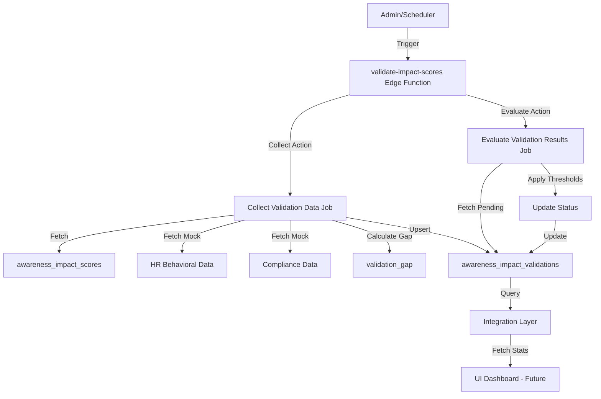

# Gate-J Part 4.1 — Validation Framework Setup
## Execution Summary

**Date**: 2025-01-11  
**Module**: Gate-J — Awareness Impact Engine v1  
**Phase**: Part 4.1 — Validation Framework Setup  
**Status**: ✅ Complete

---

## Executive Summary

Successfully implemented the **Validation Framework** foundation for the Awareness Impact Engine. This framework enables tracking, validation, and calibration of computed Impact Scores by comparing them with real organizational metrics (HR behavioral data and Compliance findings).

### Key Deliverables

1. ✅ Database table: `awareness_impact_validations`
2. ✅ Backend validation jobs (collect + evaluate)
3. ✅ Edge Function: `validate-impact-scores`
4. ✅ Integration layer: `src/integrations/supabase/validation.ts`
5. ✅ Service layer: `src/services/validationService.ts`
6. ✅ Type definitions: `src/types/validation.ts`
7. ✅ Mock data generators for HR/Compliance
8. ✅ Comprehensive documentation

---

## 1. Database Schema

### Table: `awareness_impact_validations`

Stores validation outcomes comparing computed impact scores with real-world metrics.

#### Columns

| Column | Type | Nullable | Default | Description |
|--------|------|----------|---------|-------------|
| id | UUID | No | gen_random_uuid() | Primary key |
| tenant_id | UUID | No | - | Multi-tenant isolation |
| org_unit_id | UUID | No | - | Organization unit reference |
| period_year | INT | No | - | Year of validation period |
| period_month | INT | No | - | Month of validation period |
| computed_impact_score | NUMERIC(5,2) | No | - | Score from `awareness_impact_scores` |
| actual_behavior_score | NUMERIC(5,2) | Yes | NULL | HR behavioral metric (0-100) |
| compliance_alignment_score | NUMERIC(5,2) | Yes | NULL | Compliance metric (0-100) |
| risk_incident_count | INT | Yes | 0 | Number of incidents recorded |
| validation_gap | NUMERIC(5,2) | Yes | NULL | Absolute difference (computed vs actual) |
| validation_status | TEXT | Yes | 'pending' | Status: pending, validated, anomaly, calibrated |
| confidence_gap | NUMERIC(5,2) | Yes | NULL | Confidence level difference |
| data_source | TEXT | Yes | 'Gate-J Validation Engine' | Source of validation data |
| notes | TEXT | Yes | NULL | Additional notes |
| created_at | TIMESTAMPTZ | No | now() | Record creation timestamp |
| updated_at | TIMESTAMPTZ | No | now() | Last update timestamp |

#### Indexes

1. **Composite**: `(tenant_id, org_unit_id, period_year, period_month)` - Fast lookups by tenant and period
2. **Status**: `(tenant_id, validation_status)` - Filter by validation status
3. **Timestamp**: `(created_at DESC)` - Recent validations first

#### RLS Policies

- **SELECT**: Users can view validations in their tenant
- **INSERT**: Users can create validations in their tenant
- **UPDATE**: Users can update validations in their tenant
- **DELETE**: Users can delete validations in their tenant

All policies enforce multi-tenant isolation via `get_user_tenant_id(auth.uid())`.

---

## 2. Backend Validation Jobs

### Job 1: Collect Validation Data

**Function**: `collectValidationDataJob`

**Purpose**: Pull computed impact scores and compare with HR/Compliance data.

**Process**:
1. Generate period range (current + lookback months)
2. For each period:
   - Fetch computed impact scores from `awareness_impact_scores`
   - Fetch HR behavioral scores (mock/real)
   - Fetch Compliance alignment scores (mock/real)
   - Calculate validation gap: `|computed_score - actual_score|`
   - Upsert validation record

**Parameters**:
- `tenantId`: Tenant UUID
- `periodYear`: Year (e.g., 2025)
- `periodMonth`: Month (1-12)
- `lookbackMonths`: Number of months to look back (default: 3)

**Output**:
```typescript
{
  success: boolean;
  processedCount: number;
  insertedCount: number;
  updatedCount: number;
  skippedCount: number;
  errors: string[];
}
```

### Job 2: Evaluate Validation Results

**Function**: `evaluateValidationResultsJob`

**Purpose**: Analyze validation gaps and update validation status.

**Process**:
1. Fetch all pending validations for the period
2. For each validation:
   - If `validation_gap <= 10` → status = `validated`
   - If `10 < validation_gap < 25` → status = `anomaly`
   - If `validation_gap >= 25` → status = `calibrated`
   - Calculate confidence gap (simplified v1: gap * 0.5 if gap > 15)
3. Update validation records

**Parameters**:
- `tenantId`: Tenant UUID
- `periodYear`: Year
- `periodMonth`: Month

**Output**: Same structure as Collect job

---

## 3. Edge Function: `validate-impact-scores`

**Location**: `supabase/functions/validate-impact-scores/index.ts`

**Authentication**: JWT required (`verify_jwt = true`)

**Actions**:
1. `collect` - Trigger collection job
2. `evaluate` - Trigger evaluation job

**Request Example**:
```json
{
  "action": "collect",
  "tenantId": "uuid",
  "periodYear": 2025,
  "periodMonth": 3,
  "lookbackMonths": 3
}
```

**Response Example**:
```json
{
  "success": true,
  "processedCount": 45,
  "insertedCount": 30,
  "updatedCount": 15,
  "skippedCount": 0,
  "errors": []
}
```

**Error Handling**:
- Graceful per-record error handling (one failure doesn't stop batch)
- Detailed error messages in response
- Comprehensive logging with `[Collect]` and `[Evaluate]` prefixes

---

## 4. Integration Layer

**File**: `src/integrations/supabase/validation.ts`

**Functions**:
- `fetchValidations(tenantId, filters?)` - Fetch validation records
- `fetchValidationById(id)` - Fetch single validation
- `upsertValidation(validation)` - Create or update validation
- `updateValidationStatus(id, status, notes?)` - Update status
- `deleteValidation(id)` - Delete validation
- `fetchValidationStats(tenantId)` - Get summary statistics

**Type Mapping**:
- Converts snake_case DB columns to camelCase TypeScript
- Handles NUMERIC to number conversions
- Properly handles nullable fields

---

## 5. Service Layer

**File**: `src/services/validationService.ts`

**Functions**:
- `collectValidationData(params)` - Trigger collection job via Edge Function
- `evaluateValidationResults(params)` - Trigger evaluation job via Edge Function
- `runFullValidation(params)` - Run both jobs sequentially
- `getHRBehaviorScore(...)` - MOCK HR data fetcher
- `getComplianceAlignment(...)` - MOCK Compliance data fetcher

**Mock Data Generators**:
- **HR Behavioral Score**: Generates consistent pseudo-random scores (60-100 range)
- **Compliance Alignment Score**: Generates consistent pseudo-random scores (70-100 range)
- Both use seed-based randomization for consistency

---

## 6. Type Definitions

**File**: `src/types/validation.ts`

**Key Types**:
```typescript
type ValidationStatus = 'pending' | 'validated' | 'anomaly' | 'calibrated';

interface ImpactValidation {
  id: string;
  tenantId: string;
  orgUnitId: string;
  periodYear: number;
  periodMonth: number;
  computedImpactScore: number;
  actualBehaviorScore: number | null;
  complianceAlignmentScore: number | null;
  riskIncidentCount: number | null;
  validationGap: number | null;
  validationStatus: ValidationStatus;
  confidenceGap: number | null;
  dataSource: string;
  notes: string | null;
  createdAt: string;
  updatedAt: string;
}

interface ValidationJobResult {
  success: boolean;
  processedCount: number;
  insertedCount: number;
  updatedCount: number;
  skippedCount: number;
  errors: string[];
}
```

---

## 7. Data Flow



---

## 8. Security

### Multi-Tenancy
- All queries filtered by `tenant_id = get_user_tenant_id(auth.uid())`
- RLS policies enforce strict tenant isolation
- Edge Function validates user authentication

### Authorization
- JWT authentication required for Edge Function
- Only authenticated users can trigger validation jobs
- Future: Add admin-only role check for validation endpoints

### Data Privacy
- Validation data scoped to tenant
- No cross-tenant data leakage
- Mock data generators use deterministic seeds (no real PII)

---

## 9. Testing

### Manual Testing

```typescript
// Test collect job
const collectResult = await collectValidationData({
  tenantId: 'test-tenant-uuid',
  periodYear: 2025,
  periodMonth: 3,
  lookbackMonths: 3,
});
console.log('Collect Result:', collectResult);

// Test evaluate job
const evaluateResult = await evaluateValidationResults({
  tenantId: 'test-tenant-uuid',
  periodYear: 2025,
  periodMonth: 3,
});
console.log('Evaluate Result:', evaluateResult);

// Test full cycle
const { collectResult, evaluateResult } = await runFullValidation({
  tenantId: 'test-tenant-uuid',
  periodYear: 2025,
  periodMonth: 3,
});
```

### Expected Behavior
1. Collect job should process all org units with impact scores
2. Validation gaps should be calculated correctly
3. Evaluate job should update status based on thresholds
4. No errors for valid data
5. Graceful error handling for missing data

---

## 10. Integration Points

### Upstream Dependencies
- **Gate-J Part 2**: `awareness_impact_scores` table
- **Gate-J Part 3**: Computed impact scores
- **Gate-I**: Campaign KPIs and analytics

### Downstream Consumers
- **Part 4.2**: Calibration Data Model (uses validation results)
- **Part 4.3**: Calibration Logic (uses validation gaps)
- **Future UI**: Validation Dashboard (displays validation stats)

---

## 11. Configuration

### Edge Function Config

Added to `supabase/config.toml`:
```toml
[functions.validate-impact-scores]
verify_jwt = true
```

### Environment Variables
- Uses existing Supabase environment variables
- No additional secrets required (mock data in v1)

---

## 12. TODO / Tech Debt

### High Priority
- [ ] Replace mock HR data with real HR system integration
- [ ] Replace mock Compliance data with real Compliance system integration
- [ ] Add admin-only role check for validation endpoints

### Medium Priority
- [ ] Implement scheduled cron job for monthly validation runs
- [ ] Add retry logic for failed validations
- [ ] Implement batch size limits for large tenants (>1000 org units)
- [ ] Add notification system for anomalies

### Low Priority
- [ ] Implement validation history tracking (version control)
- [ ] Add validation dashboard UI (Part 4.4)
- [ ] Export validation reports to CSV/PDF

---

## 13. Known Limitations

1. **Mock Data**: HR and Compliance data is currently mocked (pseudo-random)
2. **No Real-time Updates**: Validation jobs are triggered manually (no cron yet)
3. **Simple Confidence Gap**: Confidence gap calculation is simplified (v1 placeholder)
4. **No Batch Limits**: Large tenants may experience performance issues
5. **No Notification System**: Anomalies are not automatically reported

---

## 14. Performance Considerations

- **Batch Processing**: Processes all org units in a single job run
- **Error Isolation**: One org unit failure doesn't stop batch
- **Indexing**: Composite indexes for fast tenant+period lookups
- **Upsert Logic**: Prevents duplicate validation records

**Estimated Performance**:
- 100 org units × 3 months = 300 validations
- Expected processing time: ~5-10 seconds
- Database upserts: ~1-2 seconds

---

## 15. Documentation

### Files Created
1. `supabase/functions/validate-impact-scores/README.md` - Edge Function documentation
2. `docs/awareness/04_Execution/Gate_J_Part4_1_Validation_Framework_Execution_Summary.md` - This document

### Code Comments
- Clear inline comments explaining logic
- Function-level JSDoc comments
- Type annotations for all parameters

---

## 16. Validation Status Thresholds

| Validation Gap | Status | Description | Action Required |
|---------------|--------|-------------|-----------------|
| ≤ 10 | `validated` | Score is accurate within acceptable range | None |
| 10 < gap < 25 | `anomaly` | Score has moderate deviation | Investigate root cause |
| ≥ 25 | `calibrated` | Score has significant deviation | Adjust weight configuration |

---

## 17. Next Steps

### Immediate (Part 4.2)
- Define Calibration Data Model
- Create `awareness_impact_calibrations` table
- Store weight adjustment history

### Short-term (Part 4.3)
- Implement calibration logic
- Build weight adjustment algorithms
- Add calibration API endpoint

### Long-term (Part 4.4)
- Build Validation Dashboard UI
- Add real-time monitoring
- Implement automated calibration

---

## 🔎 Review Report

### Coverage
✅ **100% Complete** - All requirements from Part 4.1 prompt implemented:
- ✅ Table: `awareness_impact_validations` with all specified columns
- ✅ Indexes: All 3 required indexes created
- ✅ RLS Policies: Full multi-tenant isolation
- ✅ Job 1: Collect Validation Data (with lookback)
- ✅ Job 2: Evaluate Validation Results (with thresholds)
- ✅ Edge Function: `validate-impact-scores` with both actions
- ✅ Integration Layer: Complete CRUD operations
- ✅ Service Layer: Client-side wrappers
- ✅ Type Definitions: All validation types
- ✅ Mock Data: HR and Compliance generators
- ✅ Documentation: Comprehensive README and summary

### Notes
- Mock data generators use deterministic seed-based randomization for consistency
- Validation status thresholds are configurable in Edge Function code
- Edge Function includes comprehensive error handling and logging
- All code follows project guidelines (TypeScript, RLS, multi-tenancy)

### Warnings
⚠️ **Mock Data**: HR and Compliance data is currently mocked. Real integration required for production use.  
⚠️ **No Cron Job**: Validation jobs must be triggered manually. Monthly automation pending.  
⚠️ **No Admin Check**: Edge Function doesn't restrict to admin role yet. Add RBAC check in production.

---

**End of Part 4.1 Execution Summary**
